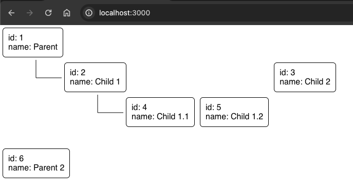

# Render Trees as Components - ts

## Description

Renders a tree, where each block is a node - a Typescript implementation.
Currently runs the app in the development mode.

## Tech Stack

### Languages

- Typescript

## Frameworks and Libraries

- React
- css
- HTML
- node

## Algorithms and Techniques

- Trees
- Parsing
- Recursion
- FileReader

## Categories

- Browser
- Data
- Trees
- Visualization

## Platforms

- Linux
- Windows
- MacOS

## Install

With `node` and `npm` installed:

```shell
npm i
```

## Usage

Edit the `./resources/input.json` with your tree.\
Currently, each tree node **must** have an `id`.

```shell
npm start
```

Open [http://localhost:3000](http://localhost:3000) to view it in the browser.

Drag and drop you input _JSON_ file with the tree (this can be _any_ data as long as it has an `id` and nested `children`).

## Preview

<picture>
    
<picture>
